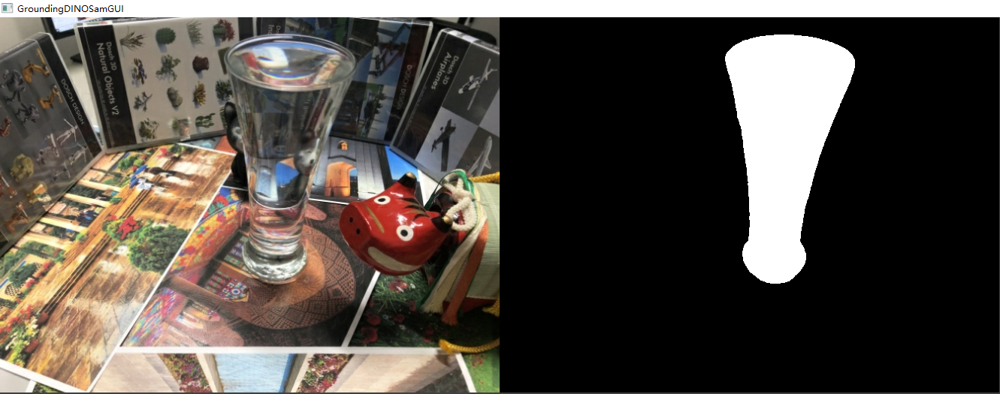

# Standalone demo : Segmentation

This is a standalone demo for segmenting transparent objects images with its own environment.


## Installation

Clone the repository and create an anaconda environment using

``` shell
cd grounded_sam2

conda env create --file environment.yml
conda activate grounded_sam2
```

The repository contains several submodules, thus please check it out with

``` shell
pip install segment_anything # Segment Anything
cd segment_anything2 & pip install -e . # Segment Anything 2
pip install --no-build-isolation -e GroundingDINO # GroundingDINO
```

In order to support SAM2, the code requires `python>=3.10`, as well as `torch>=2.3.1` and `torchvision>=0.18.1`. We have provided a functional environment compatible with both GroundingDINO and SAM2 for reference (as shown in `./environment.yml`). For specific details, please refer to the respective repositories.

## Download Checkpoints

We inherit the weights of SAM2, SAM, and GroundingDINO. For convenience, you can download all the weights for this repository directly from [Google Drive](https://drive.google.com/drive/folders/1clvtnSem5u4OTdzVn9SBNDxCL00n2dcM?usp=sharing).

## Data structure

The data structure will be organised as follows: 

```
transparentgs/
│── grounded_sam2/
│   ├── data/
│   │   ├── glass/
│   │   │   ├──images/ # input
│   │   │   │    ├── IMG_7039.JPG
│   │   │   │    ├── ...
│   │   │   ├──mask/   # output
│   ├── segment_anything2/
│   │   ├── checkpoints/
│   │   ├── bert-base-uncased/
│   │   ├── sam_gui.py
│   │   ├── dino_sam_gui.py
│   │   ├── dino_sam2_script.py
│   │   ├── ...
```

## Evaluation

``` shell
python dino_sam2_script.py --input_path <path to input images> --output_path <path to output masks> --text_prompt <text prompt> --box_threshold <box threshold> --text_threshold <text threshold>
# Example
python sam_gui.py --input_path "../data/glass/images" --output_path "../data/glass/mask"
python dino_sam_gui.py --input_path "../data/glass/images" --output_path "../data/glass/mask" --text_prompt "glass."
python dino_sam2_script.py --input_path "../data/glass/images" --output_path "../data/glass/mask" --text_prompt "glass." --is_refine
# Thanks to GroundedSAM
python grounded_sam_maxdemo.py --config GroundingDINO/groundingdino/config/GroundingDINO_SwinT_OGC.py --grounded_checkpoint checkpoints/groundingdino_swint_ogc.pth --sam_checkpoint ./checkpoints/sam_vit_h_4b8939.pth --input_image ../data/glass/images/IMG_7039.JPG --output_dir "../data/glass/demo" --box_threshold 0.3 --text_threshold 0.25 --text_prompt "glass." --device "cuda"
```





## Acknowledgements

This project is built upon [SAM2](https://github.com/facebookresearch/sam2), [GroundingDINO](https://github.com/IDEA-Research/GroundingDINO), [SAM](https://github.com/facebookresearch/segment-anything), and [GroundedSAM](https://github.com/IDEA-Research/Grounded-Segment-Anything). Please follow the licenses.